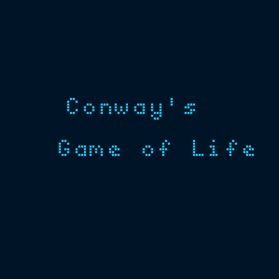

# A simple implementation of the conway's game of life written in rust.

## To Build and Run this project you need to have the following installed:

- Rust
- Cargo
- SDL2 (refer to the [guide of the embedded-graphics crate](https://docs.rs/embedded-graphics-simulator/0.6.0/embedded_graphics_simulator/#setup) for installation)

## The game is implemented using embedded-graphics and runs on a 64x64 monochrome display.
